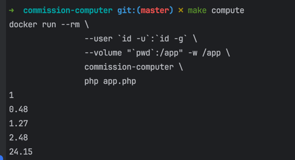
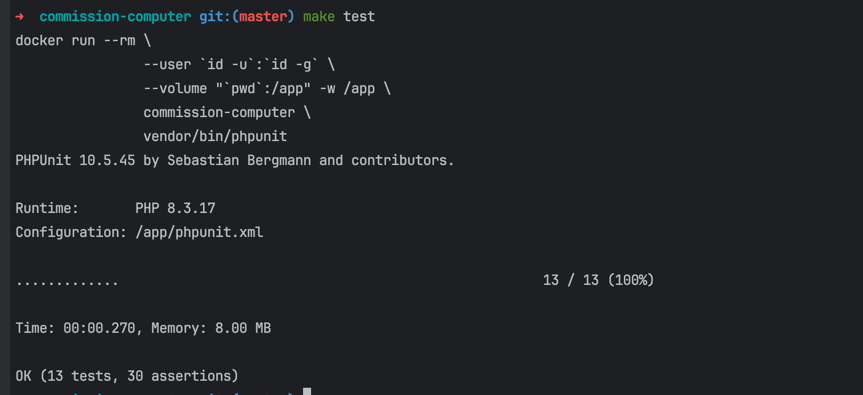

1. Copy .env.dist to the the root of project
2. Put in .env CURRENCY_RATE_API_TOKEN from https://apilayer.com/
3. Run command - make build
4. Run command - make compute
5. Run command - make test

